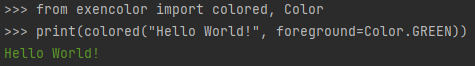
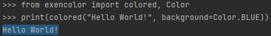
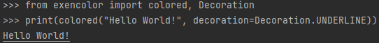
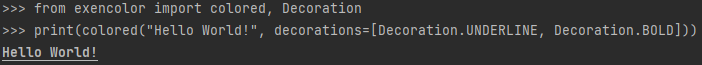
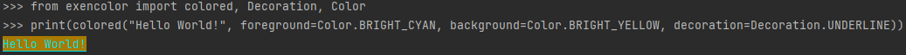

# ExenColor
A modern module for colored output.

## Installation
The module is available for installation from PyPI via pip:
```shell
$ pip install exencolor
```

## Examples

### Foreground

```python
from exencolor import colored, Color

print(colored("Hello World!", foreground=Color.GREEN))
```


### Background

```python
from exencolor import colored, Color

print(colored("Hello World!", background=Color.BLUE))
```


### Decorations

```python
from exencolor import colored, Decoration

print(colored("Hello World!", decoration=Decoration.UNDERLINE))
```


```python
from exencolor import colored, Decoration

print(colored("Hello World!", decorations=[Decoration.UNDERLINE, Decoration.BOLD]))
```


### Combined

```python
from exencolor import colored, Decoration, Color

print(colored("Hello World!", foreground=Color.BRIGHT_CYAN, background=Color.BRIGHT_YELLOW, decoration=Decoration.UNDERLINE))
```

